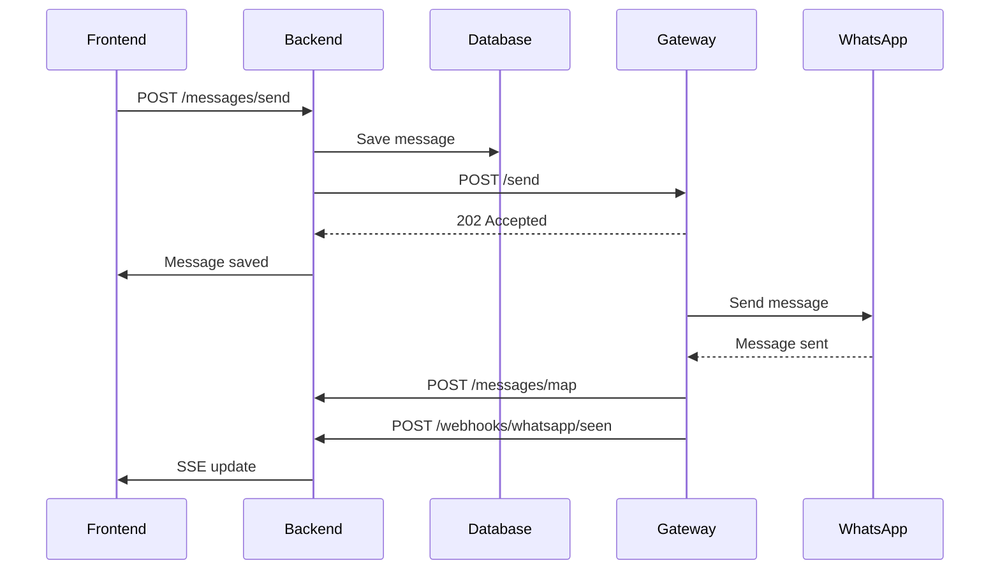

# 📡 API 接口文档 - WhatsApp CRM 系统

本文档描述了 WhatsApp CRM 系统的完整 API 接口规范，包括前后端交互和服务间通信。

---

## 🏗️ API 架构概览

```
Frontend ←→ Backend API ←→ WhatsApp Gateway
(Next.js)   (FastAPI)      (Node.js)
  :3000       :8000          :3002
```

---

## 🔧 Backend API (FastAPI - Port 8000)

### 📞 客户管理 API

#### GET /customers/summary
获取客户列表（包含最新消息摘要）

**响应示例:**
```json
[
  {
    "id": 1,
    "name": "MK Gan",
    "phone": "60127878560",
    "photo_url": "https://pps.whatsapp.net/...",
    "status": "new",
    "last_message": "Hello",
    "last_timestamp": "2025-09-23T14:05:43.040413",
    "unread_count": 0
  }
]
```

#### GET /customers/
获取完整客户列表

**响应:**
```json
[
  {
    "id": 1,
    "name": "MK Gan", 
    "phone": "60127878560",
    "status": "new",
    "remark": null,
    "extra_fields": {},
    "photo_url": "https://...",
    "unread_count": 0,
    "created_at": "2025-09-23T12:18:58",
    "updated_at": "2025-09-23T14:13:17"
  }
]
```

#### POST /customers/
创建新客户

**请求体:**
```json
{
  "name": "New Customer",
  "phone": "60123456789",
  "status": "new"
}
```

**响应:** 创建的客户对象

#### POST /customers/photo
更新客户头像

**请求体:**
```json
{
  "phone": "60123456789",
  "photo_url": "https://pps.whatsapp.net/..."
}
```

### 💬 消息管理 API

#### GET /messages/{customer_id}
获取指定客户的聊天记录

**路径参数:**
- `customer_id`: 客户ID

**响应示例:**
```json
[
  {
    "id": 1,
    "customer_id": 1,
    "direction": "inbound",
    "content": "Hello",
    "timestamp": "2025-09-23T12:19:15.176973",
    "ack": 3,
    "whatsapp_id": "3EB0E8D9F6C7F7B929B411"
  },
  {
    "id": 2,
    "customer_id": 1,
    "direction": "outbound", 
    "content": "Hi there!",
    "timestamp": "2025-09-23T12:20:30.123456",
    "ack": 2,
    "whatsapp_id": "3EB0552BC87317D062B76B"
  }
]
```

#### POST /messages/send
发送消息给客户

**请求体:**
```json
{
  "customer_id": 1,
  "content": "Hello, how are you?"
}
```

**响应:**
```json
{
  "id": 123,
  "customer_id": 1,
  "direction": "outbound",
  "content": "Hello, how are you?",
  "timestamp": "2025-09-23T14:30:00.000000",
  "ack": 1,
  "whatsapp_id": null
}
```

#### POST /messages/inbox
接收来自 WhatsApp Gateway 的消息（内部API）

**请求体:**
```json
{
  "phone": "60123456789",
  "content": "Hello",
  "name": "Customer Name"
}
```

#### POST /messages/ack
更新消息状态（内部API）

**请求体:**
```json
{
  "message_id": "3EB0E8D9F6C7F7B929B411",
  "ack": 3
}
```

**ACK 状态码:**
- `1`: 已发送 (sent)
- `2`: 已送达 (delivered)
- `3`: 已读 (read)
- `4`: 已播放 (played)

#### POST /messages/map
映射后端消息ID和WhatsApp消息ID（内部API）

**请求体:**
```json
{
  "backend_id": 123,
  "whatsapp_id": "3EB0E8D9F6C7F7B929B411"
}
```

### 📡 实时事件 API

#### GET /messages/events/stream
Server-Sent Events 实时事件流

**连接:** `EventSource('/messages/events/stream')`

**事件类型:**

1. **新消息事件:**
```json
{
  "type": "inbound_message",
  "customer_id": 1,
  "message": {
    "id": 123,
    "content": "Hello",
    "timestamp": "2025-09-23T14:30:00.000000",
    "direction": "inbound"
  }
}
```

2. **新客户事件:**
```json
{
  "type": "new_customer",
  "customer": {
    "id": 4,
    "name": "New Customer",
    "phone": "60199999999",
    "photo_url": "https://...",
    "status": "new",
    "last_message": "Hi",
    "last_timestamp": "2025-09-23T14:30:00.000000",
    "unread_count": 1
  }
}
```

3. **消息已读事件:**
```json
{
  "type": "message_seen",
  "customer_id": 1
}
```

### 🔗 Webhook API

#### POST /webhooks/whatsapp/seen
接收 WhatsApp Gateway 的已读回调

**请求体:**
```json
{
  "backend_message_id": 123,
  "whatsapp_id": "3EB0E8D9F6C7F7B929B411",
  "delay_ms": 5000,
  "to": "60123456789"
}
```

### 📊 系统监控 API

#### GET /metrics
获取系统性能指标

**响应示例:**
```json
{
  "messages_sent_total": 1543,
  "messages_received_total": 2891,
  "active_customers": 45,
  "average_response_time_ms": 150,
  "uptime_seconds": 86400
}
```

---

## 📱 WhatsApp Gateway API (Node.js - Port 3002)

### 🔐 连接状态 API

#### GET /status
获取 WhatsApp 连接状态

**响应示例:**
```json
{
  "ready": true,
  "need_qr": false,
  "session_active": true
}
```

#### GET /qr
获取登录二维码（如果需要）

**响应示例:**
```json
{
  "qr": "2@3QKg8B7z1...",
  "ready": false
}
```

### 📤 消息发送 API

#### POST /send
发送 WhatsApp 消息

**请求体:**
```json
{
  "to": "60123456789",
  "message": "Hello, this is a test message",
  "backend_message_id": 123
}
```

**响应:**
```json
{
  "status": "accepted",
  "message": "Message queued for sending"
}
```

**处理流程:**
1. 立即返回 202 Accepted
2. 异步处理消息发送
3. 通过 webhook 回调更新状态

---

## 🔄 数据流和错误处理

### 消息发送流程



### 错误响应格式

**标准错误响应:**
```json
{
  "detail": "Error message description"
}
```

**常见错误状态码:**
- `400`: Bad Request - 请求参数错误
- `404`: Not Found - 资源不存在
- `422`: Validation Error - 数据验证失败
- `500`: Internal Server Error - 服务器内部错误

### 重试机制

**消息发送重试:**
- 最多重试 3 次
- 指数退避延迟
- 失败后记录错误日志

**连接重试:**
- WhatsApp 连接断开自动重连
- SSE 连接断开前端自动重连

---

## 🔒 API 安全

### CORS 配置
```python
allow_origins=["http://localhost:3000", "http://127.0.0.1:3000"]
allow_methods=["*"]
allow_headers=["*"]
```

### 输入验证
- Pydantic 模型验证
- SQL 注入防护
- XSS 防护

### 访问控制
- 内部 API 仅供服务间调用
- 公开 API 支持前端访问
- 敏感端点访问日志

---

## 📊 API 性能

### 响应时间目标
- 客户列表: < 100ms
- 消息历史: < 200ms
- 发送消息: < 50ms
- SSE 连接: < 1s

### 并发处理
- 最大并发连接: 100
- 消息队列支持
- 数据库连接池

### 缓存策略
- 客户列表缓存
- 消息分页缓存
- 静态资源缓存

---

## 🛠️ 开发和测试

### API 文档
- Swagger UI: http://localhost:8000/docs
- ReDoc: http://localhost:8000/redoc

### 测试端点
```bash
# 健康检查
curl http://localhost:8000/metrics

# 获取客户列表
curl http://localhost:8000/customers/summary

# 测试 SSE 连接
curl -N http://localhost:8000/messages/events/stream
```

### 开发工具
- FastAPI 自动文档生成
- Pydantic 模型验证
- SQLAlchemy 查询调试

---

这个 API 文档涵盖了当前系统的所有接口，为前端开发和系统集成提供了完整的参考。