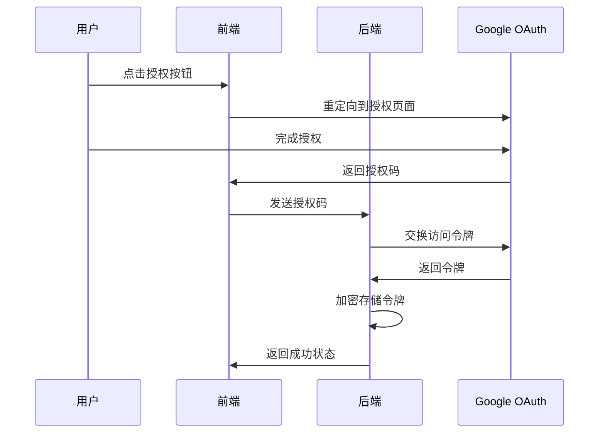

# 🔌 集成配置指南 - WhatsApp CRM 系统

本文档详细介绍如何配置 WhatsApp CRM 系统的各种集成功能，包括 WhatsApp 连接、OpenAI API 和 Google Sheets 同步。

---

## 📋 集成功能概览

系统支持以下集成功能：

| 集成服务 | 功能描述 | 状态 |
|---------|---------|------|
| **WhatsApp Web** | 消息收发、扫码登录 | ✅ 已实现 |
| **OpenAI API** | AI 智能回复、内容生成 | ✅ 已实现 |
| **Google Sheets** | 客户数据同步、报表导出 | ✅ 已实现 |

---

## 🚀 快速开始

### 1. 访问设置页面

启动系统后，访问设置页面：
```
http://localhost:3000/settings
```

### 2. 配置集成服务

按照以下顺序配置各项集成：
1. **WhatsApp 连接** - 扫码登录
2. **OpenAI API** - 配置 API Key
3. **Google Sheets** - OAuth 授权

---

## 📱 WhatsApp 集成配置

### 功能特性
- ✅ 扫码登录 WhatsApp Web
- ✅ 实时消息收发
- ✅ 会话状态管理
- ✅ 一键登出功能

### 配置步骤

#### 1. 检查连接状态
- 访问设置页面的 "WhatsApp 连接" 选项卡
- 查看当前连接状态（已连接/未连接）

#### 2. 扫码登录
如果显示需要登录：
1. 系统会自动生成 QR 码
2. 使用手机 WhatsApp 扫描二维码
3. 等待连接成功提示

#### 3. 管理连接
- **登出**: 点击"登出 WhatsApp"按钮
- **重连**: 登出后系统会自动显示新的 QR 码

### 技术实现

**Gateway API 端点:**
```javascript
GET  /status     # 获取连接状态
GET  /qr         # 获取 QR 码
POST /logout     # 登出当前会话
POST /send       # 发送消息
```

**状态响应示例:**
```json
{
  "ready": true,
  "need_qr": false,
  "session_active": true
}
```

---

## 🤖 OpenAI API 集成

### 功能特性
- ✅ API Key 安全存储（加密）
- ✅ 连接状态测试
- ✅ AI 智能回复（待开发）
- ✅ 内容生成功能（待开发）

### 配置步骤

#### 1. 获取 OpenAI API Key
1. 访问 [OpenAI 官网](https://platform.openai.com/)
2. 登录并前往 API Keys 页面
3. 创建新的 API Key（格式：`sk-...`）

#### 2. 配置 API Key
1. 在设置页面选择 "OpenAI 配置" 选项卡
2. 输入有效的 API Key
3. 点击"保存配置"

#### 3. 验证配置
- 系统会自动验证 API Key 格式
- 配置成功后，Key 会被加密存储
- 显示时会使用掩码格式（●●●●●●●●）

### 安全机制

**数据加密:**
- 使用 Fernet 对称加密
- 密钥存储在数据库中
- API Key 从不以明文存储

**API 端点:**
```python
POST /settings/openai          # 保存 API Key
GET  /settings/integrations    # 获取配置（掩码）
POST /settings/test-openai     # 测试连接
DELETE /settings/openai        # 删除配置
```

---

## 📊 Google Sheets 集成

### 功能特性
- ✅ OAuth 2.0 安全授权
- ✅ 客户数据同步
- ✅ 电子表格创建
- ✅ 自动数据导出
- ✅ 实时数据更新

### 配置步骤

#### 1. 创建 Google Cloud 项目
1. 访问 [Google Cloud Console](https://console.cloud.google.com/)
2. 创建新项目或选择现有项目
3. 启用 Google Sheets API 和 Google Drive API

#### 2. 创建 OAuth 2.0 凭据
1. 在 APIs & Services > Credentials 页面
2. 点击 "Create Credentials" > "OAuth client ID"
3. 选择 "Web application"
4. 配置授权回调 URI：
   ```
   http://localhost:3000/auth/google/callback
   ```
5. 记录 Client ID 和 Client Secret

#### 3. 系统配置
1. 在设置页面选择 "Google Sheets" 选项卡
2. 输入 Client ID 和 Client Secret
3. 确认重定向 URI 正确
4. 点击"保存配置"

#### 4. OAuth 授权
1. 点击"授权 Google Sheets"按钮
2. 在弹出窗口中完成 Google 授权
3. 授权成功后会自动跳转回设置页面

### OAuth 流程



### API 使用示例

**获取电子表格列表:**
```python
from app.services.google_sheets import GoogleSheetsService

service = GoogleSheetsService(db)
result = await service.get_spreadsheets()
```

**创建新电子表格:**
```python
result = await service.create_spreadsheet("客户数据导出")
spreadsheet_id = result["spreadsheet_id"]
```

**导出客户数据:**
```python
customers_data = [
    {"id": 1, "name": "客户A", "phone": "123456789", ...},
    {"id": 2, "name": "客户B", "phone": "987654321", ...}
]
result = await service.write_customer_data(spreadsheet_id, customers_data)
```

---

## 🔒 安全和隐私

### 数据加密
- **敏感配置**: 使用 Fernet 对称加密
- **传输安全**: HTTPS 传输（生产环境）
- **令牌管理**: 安全存储访问令牌和刷新令牌

### 权限控制
- **最小权限原则**: 仅请求必要的 API 权限
- **令牌刷新**: 自动处理令牌过期和刷新
- **安全撤销**: 支持撤销授权和删除令牌

### 数据隐私
- **本地存储**: 所有配置存储在本地数据库
- **无第三方传输**: 配置信息不会发送给第三方
- **用户控制**: 用户可随时删除集成配置

---

## 🛠️ 开发和测试

### 环境变量
```bash
# .env 文件
OPENAI_API_KEY=sk-...                    # OpenAI API Key
GOOGLE_CLIENT_ID=xxx.apps.googleusercontent.com
GOOGLE_CLIENT_SECRET=GOCSPX-xxx
```

### 数据库表结构
```sql
-- 设置表
CREATE TABLE settings (
    id INTEGER PRIMARY KEY,
    key STRING UNIQUE NOT NULL,
    value TEXT,
    description STRING,
    created_at DATETIME DEFAULT CURRENT_TIMESTAMP,
    updated_at DATETIME DEFAULT CURRENT_TIMESTAMP
);

-- 存储的配置项
-- encryption_key: 加密密钥
-- openai_api_key: OpenAI API Key (加密)
-- google_sheets_client_id: Google Client ID
-- google_sheets_client_secret: Google Client Secret (加密)
-- google_sheets_redirect_uri: 重定向 URI
-- google_sheets_access_token: 访问令牌 (加密)
-- google_sheets_refresh_token: 刷新令牌 (加密)
```

### API 测试命令
```bash
# 获取集成配置
curl http://localhost:8000/settings/integrations

# 保存 OpenAI API Key
curl -X POST http://localhost:8000/settings/openai \
  -H "Content-Type: application/json" \
  -d '{"api_key": "sk-..."}'

# 测试 WhatsApp 状态
curl http://localhost:3002/status

# 获取电子表格列表（需要先授权）
curl http://localhost:8000/settings/google-sheets/spreadsheets
```

---

## 🚨 故障排除

### WhatsApp 连接问题

**问题**: QR 码不显示
- **解决**: 检查 WhatsApp Gateway 服务是否运行
- **命令**: `http://localhost:3002/status`

**问题**: 扫码后连接失败
- **解决**: 清除会话数据，重新初始化
- **方法**: 删除 `whatsapp_gateway/.wwebjs_auth` 文件夹

### OpenAI API 问题

**问题**: API Key 验证失败
- **检查**: 确保 Key 格式正确（以 `sk-` 开头）
- **验证**: 在 OpenAI 官网检查 Key 状态

**问题**: API 调用失败
- **检查**: API Key 余额和使用限制
- **解决**: 更新 API Key 或增加额度

### Google Sheets 问题

**问题**: OAuth 授权失败
- **检查**: Client ID 和 Secret 是否正确
- **验证**: Google Cloud Console 中的凭据配置

**问题**: 重定向 URI 不匹配
- **解决**: 确保回调 URI 与 Google Cloud 配置一致
- **格式**: `http://localhost:3000/auth/google/callback`

---

## 📈 扩展功能

### 计划中的集成
- 🔄 **微信集成**: 微信消息收发
- 📧 **邮件集成**: SMTP/IMAP 邮件处理
- 📱 **短信集成**: SMS 短信发送
- 💬 **Slack 集成**: 团队协作通知
- 📊 **数据分析**: 高级报表和分析

### 自定义集成
系统架构支持添加新的集成服务：

1. **创建服务类**: 继承基础集成接口
2. **添加配置模式**: 定义配置参数
3. **实现 OAuth**: 添加授权流程
4. **注册路由**: 添加 API 端点
5. **更新前端**: 添加配置界面

---

## 📞 技术支持

### 常见问题
- 查看系统日志：`backend/logs/`
- 检查服务状态：`/metrics` 端点
- 数据库查询：SQLite 客户端

### 联系支持
- 📧 技术支持：support@example.com
- 📖 文档中心：`docs/` 目录
- 🐛 问题反馈：GitHub Issues

---

这个集成配置指南提供了完整的设置流程和技术细节，帮助用户和开发者快速配置和使用系统的各种集成功能。
